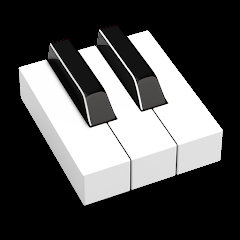
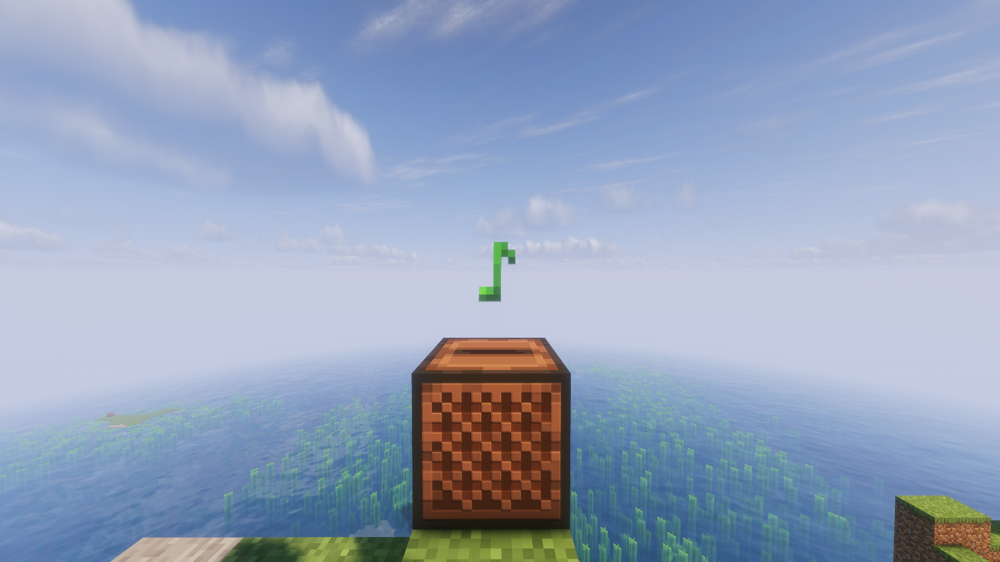

  

  # Piano Music Overhaul

  **Replaces Minecraft's background music and all music discs with piano versions.**

  

---

## 🎵 Overview

**Piano Music & Discs** gives Minecraft a completely new sound. Every background track you hear while playing—from the main menu to the End—has been replaced with a piano version, and so has every music disc in the game. Mine, build, explore, and fight the same as always, just with a peaceful piano soundtrack behind you.

---

## ✨ Features

* **Full Background Music Replacement:** All environment tracks (Main Menu, Overworld, Nether, The End, Creative mode) replaced with piano interpretations.
* **All Music Discs Replaced:** Every in-game music disc now features a piano arrangement.
* **100% Visual Compatibility:** The pack **only changes audio**. There are no texture, model, or gameplay changes, making it fully compatible alongside any other visual resource pack.

---

## 📥 Installation

1. Download the resource pack zip file from [Modrinth](https://modrinth.com).
2. Launch Minecraft and go to **Options** > **Resource Packs...**
3. Click **Open Pack Folder**.
4. Drag and drop the downloaded `.zip` file into the `resourcepacks` directory.
5. In Minecraft, move **Piano Music Overhaul** to the right-hand column and click **Done**.

---

## 📄 License

Distributed under the standard resource pack guidelines. See `LICENSE` for more information.
